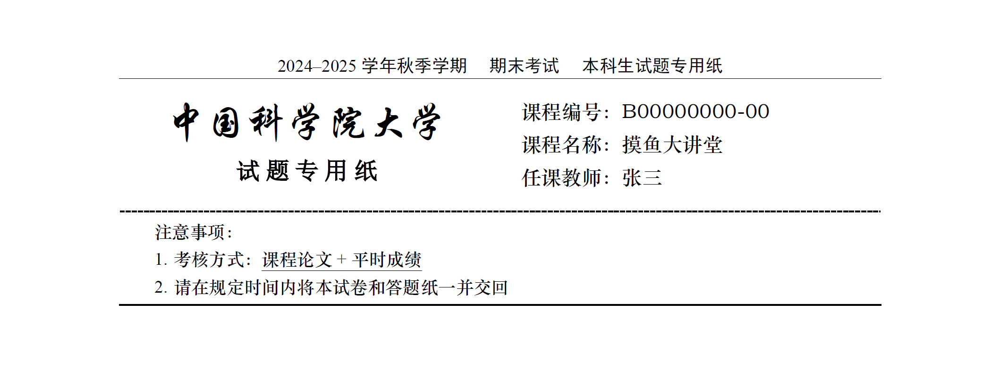

# UCAS 本科生 期中/期末考试 $\LaTeX$ 模板使用说明

本仓库是中国科学院大学 (UCAS) 本科部官方给出的期中/期末考试的试题卷、读书报告、结课论文等所使用的模板。

原模板以 Word 形式给出，这对需要很多公式的绝大多数科目的试卷的老师和助教、 $\LaTeX$ 原教旨主义者和被 Word 排版迫害者撰写他们的读书报告和结课论文造成了极大困扰。

因此，特地将此模板上传，提供给大家免费、无需授权地使用。

以下是使用该模板的详细步骤。如果你是不熟悉 $\LaTeX$ 的小白，欢迎在 Issue 或国科大 $\LaTeX$ 交流群中提问。

## 效果介绍

模板的大致样貌如下：



## 下载模板

- GitHub 页面右边点击：Code -> Download Zip
- Overleaf

## 所需字体

请确保 SIMSUN.TTC, STXINGKA.TTF, STZHONGS.TTF 三个文件与 `main.tex` 在同一文件夹下。

## 编译模板

模板使用 `xelatex` 进行编译。

### 编译步骤

1. 使用 TexWorks 或 Visual Studio Code 中的 `LaTeX Workshop` 插件，编译时选择 “XeLaTeX” 选项。

2. 命令行编译

    1. 打开终端或命令提示符。
    2. 导航到模板所在目录。
    3. 运行以下命令进行编译：

        ```sh
        xelatex main.tex
        ```

## 自定义修改内容

模板提供了多种自定义选项，用户可以根据需要进行修改。

在 `main.tex` 文件中，找到以下部分并根据需要修改：

### 修改课程编号、课程名称、任课教师等信息

```tex
% 这里可以自定义课程编号、课程名称、任课教师等信息
\newcommand{\classNumber}{B00000000-00} % 课程编号
\newcommand{\className}{摸鱼大讲堂} % 课程名称
\newcommand{\teacherName}{张三} % 任课教师
```

### 修改页眉内容

```tex
% 这里可以自定义页眉的内容
\newcommand{\yearOfTerm}{2024--2025} % 学年开始和结束年份, 请确保中间有两个短横线
\newcommand{\semester}{秋季} % 学期: 秋季/春季
\newcommand{\partTwo}{期末考试} % 页眉第二段内容
\newcommand{\partThree}{本科生试题专用纸} % 页眉第三段内容
```

### 修改注意事项

```tex
% 请在下方直接修改 "注意事项" 的内容
% \underline{某些字} 用于给 "某些字" 添加下划线
1. 考核方式：\underline{课程论文+平时成绩}

2. 请在规定时间内将本试卷和答题纸一并交回
```

## 协议：CC0 1.0 通用

本模板采用 Creative Commons 制定的 CC0 1.0 通用协议。该协议的普通文本如下。

注意，下面的不是一份法律文件。它只是用于理解CC0许可协议的法律文本的一份参考，以普通人易于理解的语言解释法律文本的一些核心条款。

若需要详细的法律文本，请参考 [LICENSE 文件](LICENSE) 或 [Creative Commons 网站上的原文](https://creativecommons.org/publicdomain/zero/1.0/)。

### 无版权
在作品上适用该文本的人已经将作品 贡献 至公共领域，放弃所有他/她在全世界范围内基于版权法对作品享有的权利至法律允许的范围，包括所有类似和邻接权利。

您可以复制、修改、发行和表演本作品，甚至可用于商业性目的，都无需要求同意。请看 以下其他信息 。

### 其他信息

In no way are the patent or trademark rights of any person affected by CC0, nor are the rights that other persons may have in the work or in how the work is used, such as publicity or privacy rights.

除非另有明确声明，本协议项下的作品关联人，在可适用法律所允许的最大限度内，不对本作品提供担保，不承担因本作品使用产生的责任。

当使用或引用本作品，您不得暗示 作者或声明人认可你 。


## 致谢

感谢查无此人、芋圆公式二位同学在模板创作方面给我的启发。
